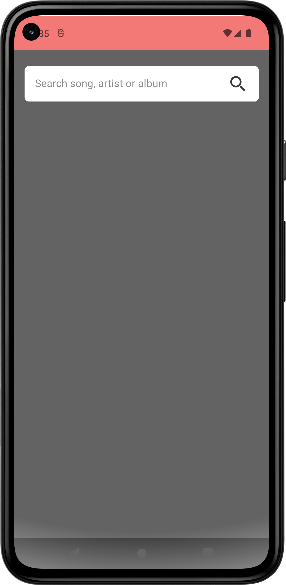
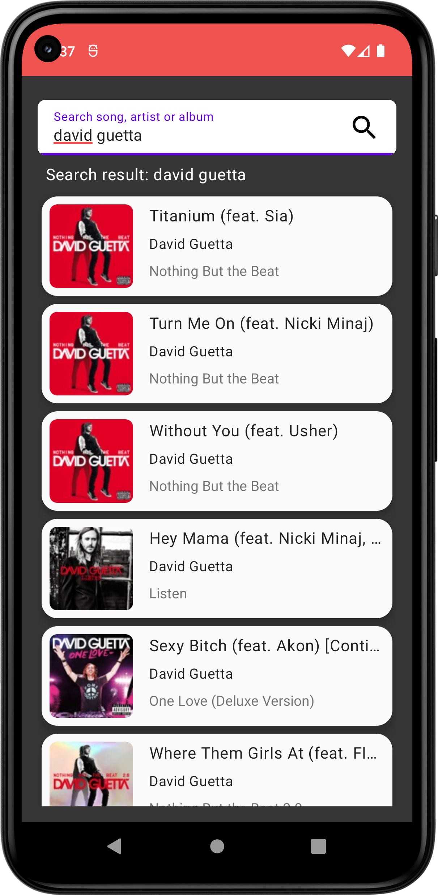
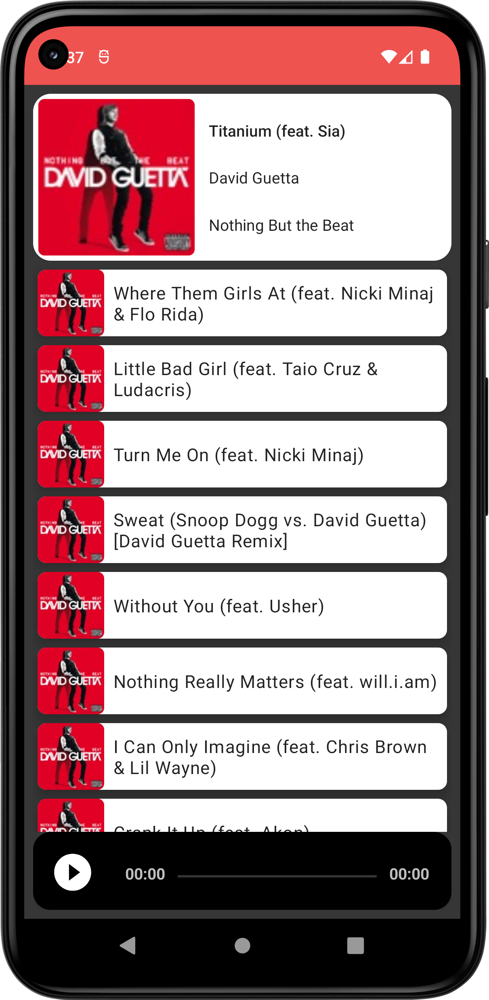

## Itunes Search [](https://developer.android.com/reference)  [](https://developer.android.com/studio/releases/platforms#8.0)  [![LinkedIn][linkedin-shield]][linkedin-url]
<p align="center">

</p>


Es una app que permite buscar canciones por nombre,autor y album.
Al seleccionar una cancion, muestra a que album pertenece y todas las canciones del mismo.
Asi tambien nos permite reproducir una preview de 30 segundos de cualquier cancion

haciendo uso de [iTunes Search API](https://developer.apple.com/library/archive/documentation/AudioVideo/Conceptual/iTuneSearchAPI/Searching.html#//apple_ref/doc/uid/TP40017632-CH5-SW1)

## Screenshots
  



## Arquitecura 
[Model-View-ViewModel (MVVM)](https://en.wikipedia.org/wiki/Model%E2%80%93view%E2%80%93viewmodel):
El patrón Model-View-ViewModel (MVVM) ayuda a separar limpiamente la lógica de negocios y presentación de una aplicación de su interfaz de usuario (UI).  facilita los tests, el mantenimiento y la evolución de una aplicación. También puede mejorar considerablemente las oportunidades de reutilización del código.


[Clean Arquitecture](https://blog.cleancoder.com/uncle-bob/2012/08/13/the-clean-architecture.html):
Es una arquitecurta en la que todas las capas que componen el software son independientes unas de otras de manera que, a la hora de ampliar las funcionalidades de un proyecto o cambiar un componente por otro, no haya conflicto y este cambio se realice con el menor coste de tiempo posible.

En el proyecto se usaron 3 capas 
- Domain 
- Data 
- App

## Estructura del Proyecto
```

├── app (module)                 
│      ├── application  
│      ├── di  
│      └── ui            
|          ├── activity  
|          ├── adapter
│          └── viewmodel
│
├── data (module)             
│      ├── remote      
|      │   ├── api      
|      |   └── dto    
│      │
│      ├── repository        
│      └── utils
│      └── di
|         
└── domain (module)                 
       ├── entities  
       ├── repository  
       └── usecases            
```

  
## Herramientas y Librerias
 
- [ViewBinding](https://developer.android.com/topic/libraries/view-binding?hl=es-419).
- [Coroutines](https://developer.android.com/kotlin/coroutines): A coroutine is a concurrency design
  pattern that you can use on Android to simplify code that executes asynchronously.
- [LiveData](https://developer.android.com/topic/libraries/architecture/livedata): Data objects
  that notify views when the underlying database changes.
- [ViewModel](https://developer.android.com/topic/libraries/architecture/viewmodel): Stores
   UI-related data that isn't destroyed on UI changes.
- [Paging 3](https://developer.android.com/topic/libraries/architecture/paging): The Paging
  Library helps you load and display small chunks of data at a time. Loading partial data on
  demand reduces usage of network bandwidth and system resources.
- [Retrofit 2](https://github.com/JakeWharton/retrofit2-kotlinx-serialization-converter): A Retrofit
  2 Converter.Factory for Kotlin serialization.
- [Picasso](https://square.github.io/picasso/):A powerful image downloading and caching library for Android
- [Exoplayer](https://exoplayer.dev/):ExoPlayer is an application level media player for Android. It provides 
  an alternative to Android’s MediaPlayer API for playing audio and video both locally and over the Internet
- [Koin](https://insert-koin.io/docs/setup/koin): for dependenci Injection
- [Mockito](https://site.mockito.org/):Tasty mocking framework for unit tests in Java
- [Moshi](https://github.com/square/moshi):Moshi is a modern JSON library for Android, Java and Kotlin. It makes it easy to parse JSON into Java and Kotlin classes


<!-- MARKDOWN LINKS & IMAGES -->

[linkedin-shield]: https://img.shields.io/badge/LinkedIn-0077B5?style=for-the-badge&logo=linkedin&logoColor=white
[linkedin-url]: https://linkedin.com/in/othneildrew](https://www.linkedin.com/in/agustin-de-elias-boque-4904659a/
